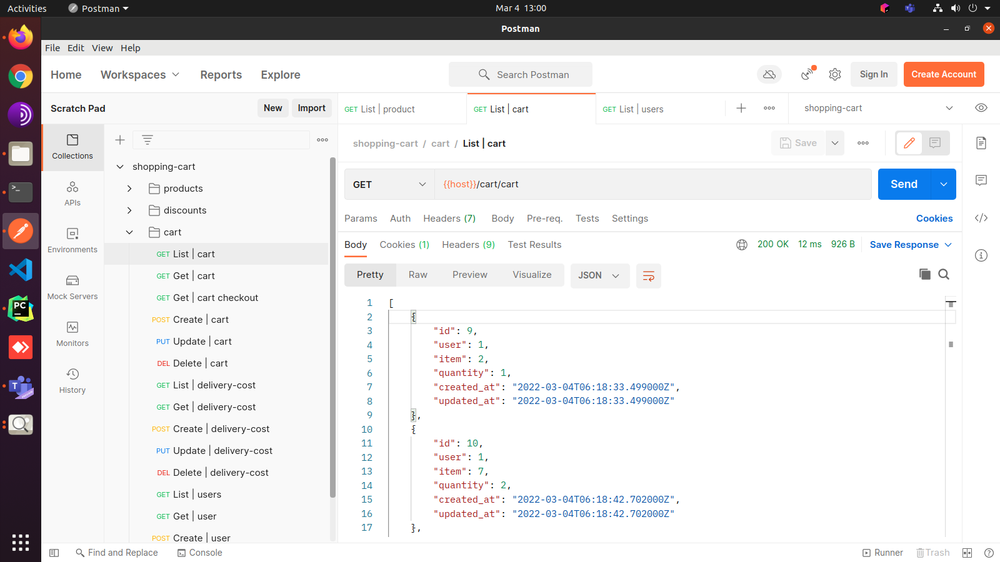

# shopping-cart

Clone the repo
```bash
$ git clone https://github.com/vchrombie/django-behave-playground/
$ cd django-behave-playground
```

Install the project
```bash
$ poetry install
$ poetry shell
```

Django project setup
```bash
(.venv) $ makemigrations
(.venv) $ migrate
(.venv) $ createsuperuser # admin:admin
(.venv) $ python manage.py loaddata shopping_cart/fixtures/data.json
(.venv) $ server
```

You can see the django application would be running at the respective port (default: 8000)
- django application: http://127.0.0.1:8000/
- admin panel: http://127.0.0.1:8000/admin/
- swagger api documentation: http://127.0.0.1:8000/swagger/

You can [import the collection and environment on Postman](https://testfully.io/blog/import-from-postman/) to test the application right away. The JSON configurations are in the [postman](postman) directory.

