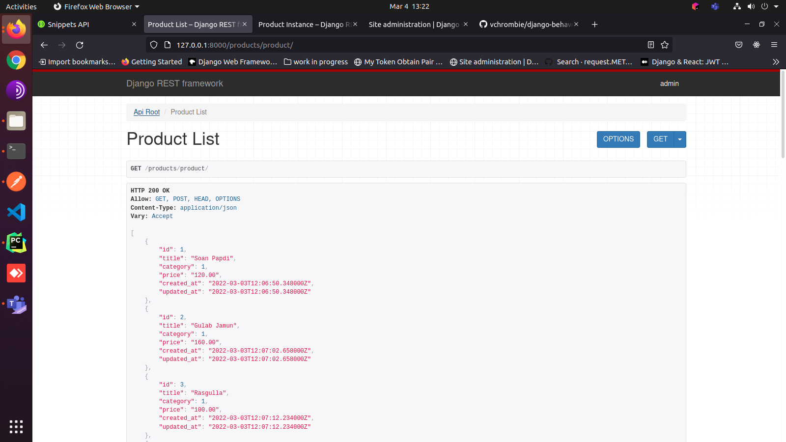

# shopping-cart

### Setup

Clone the repo
```bash
$ git clone https://github.com/vchrombie/django-behave-playground/
$ cd django-behave-playground
```

Install the project
```bash
$ poetry install
$ poetry shell
```

Django project setup
```bash
(.venv) $ makemigrations
(.venv) $ migrate
(.venv) $ createsuperuser # admin:admin
(.venv) $ python manage.py loaddata shopping_cart/fixtures/data.json
(.venv) $ server
```

You can see the django application would be running at the respective port (default: 8000)
- django application: http://127.0.0.1:8000/
- admin panel: http://127.0.0.1:8000/admin/
- swagger api documentation: http://127.0.0.1:8000/swagger/

You can [import the collection and environment on Postman](https://testfully.io/blog/import-from-postman/) to test the application right away. The JSON configurations are in the [postman](postman) directory.

### Tests

#### Unit Tests

coverage is configured with the project, you can check the coverage using the following command
```
$ coverage run --source='.' manage.py test
Creating test database for alias 'default'...
System check identified no issues (0 silenced).
..................
----------------------------------------------------------------------
Ran 18 tests in 0.150s

OK
Destroying test database for alias 'default'...
```
```
$ coverage report -m
Name                       Stmts   Miss  Cover   Missing
--------------------------------------------------------
cart/admin.py                  6      0   100%
cart/apps.py                   4      0   100%
cart/helpers.py               77      0   100%
cart/models.py                28      0   100%
cart/serializers.py           14      0   100%
cart/tests.py                 99      0   100%
cart/urls.py                   8      0   100%
cart/views.py                 26      0   100%
discounts/admin.py             4      0   100%
discounts/apps.py              4      0   100%
discounts/helpers.py          36      0   100%
discounts/models.py           25      0   100%
discounts/serializers.py      10      0   100%
discounts/tests.py            35      0   100%
discounts/urls.py              7      0   100%
discounts/views.py             9      0   100%
products/admin.py              4      0   100%
products/apps.py               4      0   100%
products/models.py            20      0   100%
products/serializers.py       10      0   100%
products/tests.py             41      0   100%
products/urls.py               7      0   100%
products/views.py              9      0   100%
--------------------------------------------------------
TOTAL                        487      0   100%

```

#### Lint

flake8 is configured with the project, you can run the lint check using the following command
```
$ flake8

```

### Screenshots

admin panel


swagger


product list


product detail


postman


cart checkout

